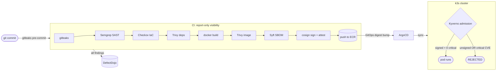

# Secure Software Supply Chain Pipeline

An end-to-end DevSecOps pipeline for a deliberately vulnerable app: every stage
from `git commit` to cluster admission is gated by a security control. The point
isn't that the app is clean — it's intentionally not — it's that **nothing
insecure reaches production without a control catching it or blocking it**.

The scanners provide *visibility* (they report into DefectDojo and never block
the demo). The *enforcement* happens at admission: Kyverno refuses to run the
image unless it was signed by this pipeline **and** its vulnerability attestation
shows zero criticals. So CI happily builds, signs, and pushes the vulnerable
image — and the cluster rejects it. That rejection is the demo.

## Flow



## What each stage catches

| Stage | Tool | Catches | Where |
|-------|------|---------|-------|
| Pre-commit | **gitleaks** | secrets before they're committed | [`.pre-commit-config.yaml`](.pre-commit-config.yaml), [`.gitleaks.toml`](.gitleaks.toml) |
| SAST | **Semgrep** | command injection, hardcoded secrets | [`semgrep/rules.yaml`](semgrep/rules.yaml) |
| Dependencies | **Trivy fs** | vulnerable npm packages | [pipeline `trivy-fs`](.github/workflows/pipeline.yml) |
| IaC | **Checkov** | misconfigured Terraform | [`terraform/`](terraform/), [`.checkov.yaml`](.checkov.yaml) |
| Image | **Trivy image** | OS + lib CVEs in the container | [pipeline `build-sign-push`](.github/workflows/pipeline.yml) |
| Provenance | **Syft** | SBOM (CycloneDX + SPDX) | [`scripts/generate-sbom.sh`](scripts/generate-sbom.sh) |
| Integrity | **cosign** | keyless signature + SBOM/vuln attestations | [`scripts/sign-and-attest.sh`](scripts/sign-and-attest.sh) |
| Aggregation | **DefectDojo** | one dashboard for every finding | [`scripts/defectdojo-upload.sh`](scripts/defectdojo-upload.sh) |
| Delivery | **ArgoCD** | GitOps sync from the repo | [`argocd/application.yaml`](argocd/application.yaml) |
| **Admission gate** | **Kyverno** | rejects unsigned or critically-vulnerable images | [`policies/kyverno/`](policies/kyverno/) |

## The supply-chain gate (the interesting part)

1. CI runs `trivy image --format cosign-vuln` and `cosign attest`s the result to
   the image digest — a signed, tamper-evident record of its vulnerabilities.
2. Syft's SBOM is attested the same way.
3. Both are signed **keyless** via the GitHub Actions OIDC identity (Fulcio +
   Rekor transparency log) — no long-lived private key to leak.
4. At deploy, [`block-critical-vulnerabilities`](policies/kyverno/verify-vuln-attestation.yaml)
   makes Kyverno fetch that attestation, verify our pipeline signed it, and count
   criticals. Non-zero → pod denied. [`verify-image-signature`](policies/kyverno/verify-signature.yaml)
   independently rejects anything we didn't sign at all.

This maps to SLSA provenance: the artifact carries verifiable evidence of *how it
was built and what's in it*, and the cluster enforces on that evidence.

## Run it

```bash
make hooks          # install the gitleaks pre-commit hook
make scan           # run every scanner locally into artifacts/
make build sbom     # build the image + generate its SBOM
make defectdojo     # push findings to DefectDojo (see defectdojo/README.md)
```

Cluster gate demo (needs k3s + Kyverno + ArgoCD):

```bash
make policies       # apply Kyverno admission policies
make deploy         # register the ArgoCD app; watch the pod get REJECTED
```

CI needs these repo secrets: `AWS_ROLE_ARN` (OIDC role that can push to ECR),
`DEFECTDOJO_URL`, `DEFECTDOJO_API_KEY`. Terraform in [`terraform/`](terraform/)
provisions the ECR repo (immutable tags, KMS encryption, scan-on-push).

## Layout

```
app/                 deliberately vulnerable Node app + Dockerfile
terraform/           ECR repository (scanned by Checkov)
semgrep/             custom SAST rules
scripts/             SBOM, sign+attest, DefectDojo upload
.github/workflows/   the pipeline (the spine)
k8s/                 Deployment/Service/Namespace (ArgoCD source)
argocd/              GitOps Application
policies/kyverno/    admission gate: signature + vuln attestation
defectdojo/          how to stand up the aggregation dashboard
```

## Swapping in OWASP Juice Shop

The demo app keeps the repo small and makes every scanner fire predictably. To
target Juice Shop instead, replace [`app/Dockerfile`](app/Dockerfile) with a
single `FROM bkimminich/juice-shop` — the rest of the pipeline is unchanged.

> ⚠️ The app under `app/` is **intentionally vulnerable** (command injection,
> hardcoded secret, outdated deps). It exists to be scanned. Do not deploy it.
