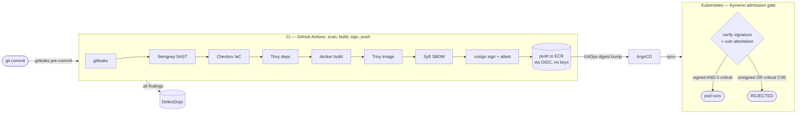

# Secure Software Supply Chain Pipeline

An end-to-end DevSecOps pipeline that takes an application from `git commit` all
the way to a running Kubernetes pod, and puts a **security control at every
stage**. The sample app is deliberately vulnerable — the point isn't that the app
is clean, it's that **nothing insecure reaches production without a control
catching it or blocking it**.

The design in one line: *scanners provide visibility, admission control provides
enforcement.* CI scans everything and reports it, but never blocks the
intentionally-vulnerable demo. The hard gate is at deploy time — the cluster
refuses to run an image unless the pipeline signed it **and** its signed
vulnerability record shows zero critical CVEs. CI happily builds, signs, and
pushes the vulnerable image; the cluster rejects it. **That rejection is the
demo.**

> Built around SBOMs, signing, attestations, and SLSA-style provenance — the
> supply-chain security stack (Sigstore/cosign, Syft, Kyverno) that's become the
> hottest area in the field.

---

## Contents

1. [What this demonstrates](#what-this-demonstrates)
2. [Architecture](#architecture)
3. [The pipeline, stage by stage](#the-pipeline-stage-by-stage)
4. [Key concepts](#key-concepts) — the parts to actually understand
5. [The supply-chain gate](#the-supply-chain-gate-the-punchline)
6. [Getting started](#getting-started) — four paths, from "just look" to "run it all"
7. [Adapt it to your own app](#adapt-it-to-your-own-app)
8. [Repository layout](#repository-layout)
9. [Engineering notes](#engineering-notes-real-problems-solved)
10. [Security & cost](#security--cost)

---

## What this demonstrates

A single project covering the full modern secure-SDLC job description:

- **Shift-left scanning** — secrets, SAST, dependency CVEs, and IaC misconfig, all in CI.
- **Supply-chain integrity** — SBOM generation, keyless signing, and signed attestations (SLSA provenance).
- **Policy-as-code enforcement** — a Kubernetes admission controller that makes runtime decisions on cryptographic evidence.
- **GitOps delivery** — the git repo is the source of truth; ArgoCD syncs it.
- **Keyless / keyless-everywhere** — OIDC federation means no long-lived cloud keys or signing keys exist to leak.
- **Vulnerability management** — every finding aggregated into one dashboard (DefectDojo).

## Architecture



## The pipeline, stage by stage

| # | Stage | Tool | What it catches | Where |
|---|-------|------|-----------------|-------|
| 1 | Pre-commit | **gitleaks** | secrets, before they're committed | [`.pre-commit-config.yaml`](.pre-commit-config.yaml), [`.gitleaks.toml`](.gitleaks.toml) |
| 2 | SAST | **Semgrep** | command injection, hardcoded secrets in source | [`semgrep/rules.yaml`](semgrep/rules.yaml) |
| 3 | Dependencies | **Trivy (fs)** | vulnerable npm packages | [pipeline](.github/workflows/pipeline.yml) |
| 4 | IaC | **Checkov** | misconfigured Terraform | [`terraform/`](terraform/), [`.checkov.yaml`](.checkov.yaml) |
| 5 | Image | **Trivy (image)** | OS + library CVEs in the container | [pipeline](.github/workflows/pipeline.yml) |
| 6 | Provenance | **Syft** | SBOM — full inventory of what's inside | [`scripts/generate-sbom.sh`](scripts/generate-sbom.sh) |
| 7 | Integrity | **cosign** | keyless signature + SBOM/vuln attestations | [`scripts/sign-and-attest.sh`](scripts/sign-and-attest.sh) |
| 8 | Registry | **ECR + OIDC** | signed image storage, no stored AWS keys | [`terraform/`](terraform/) |
| 9 | Aggregation | **DefectDojo** | one dashboard for every finding | [`scripts/defectdojo-upload.sh`](scripts/defectdojo-upload.sh) |
| 10 | Delivery | **ArgoCD** | GitOps sync from the repo | [`argocd/application.yaml`](argocd/application.yaml) |
| 11 | **Admission gate** | **Kyverno** | **rejects unsigned or critically-vulnerable images** | [`policies/kyverno/`](policies/kyverno/) |

The spine that runs stages 1–9 on every push is [`.github/workflows/pipeline.yml`](.github/workflows/pipeline.yml).

## Key concepts

If you take one thing from this repo, take these — they're what make it more than "a bunch of scanners in CI."

- **SBOM (Software Bill of Materials)** — a machine-readable inventory of every package inside the image. Syft produces it in CycloneDX and SPDX. It answers "am I affected by CVE-X?" in seconds instead of a fire drill.
- **Keyless signing** — cosign signs the image using GitHub Actions' short-lived OIDC identity via Sigstore (Fulcio issues a momentary certificate, Rekor logs it publicly). **There is no private signing key** to store or leak; the signature proves "the pipeline in *this* repo produced this exact image."
- **Attestation** — a *signed statement about* an artifact. Here, the SBOM and the Trivy vulnerability report are each attached to the image as signed attestations. The cluster later makes admission decisions on that evidence — it doesn't re-scan, it trusts a signed record it can verify.
- **Admission control** — Kyverno sits in the Kubernetes API path and inspects every pod *before* it runs. Policies here fail **closed**: can't verify → deny.
- **OIDC federation** — CI pushes to AWS ECR with *zero* stored access keys. GitHub presents a short-lived token; an IAM trust policy scoped to only this repo's `main` branch accepts it. Same trust model as the signing.
- **Visibility vs. enforcement** — the deliberate split: scanners *report* (soft, non-blocking), admission *enforces* (hard, blocking). This is why the vulnerable demo builds successfully yet still can't run.
- **SLSA** — Supply-chain Levels for Software Artifacts. The image carries verifiable evidence of *how it was built and what's in it*, and the runtime enforces on that evidence.

## The supply-chain gate (the punchline)

The most interesting part is the loop between build-time attestation and deploy-time enforcement:

1. CI runs `trivy image --format cosign-vuln` and `cosign attest`s the result to the image digest — a signed, tamper-evident record of the image's vulnerabilities.
2. Syft's SBOM is attested the same way.
3. Both are signed **keyless** via the GitHub Actions OIDC identity.
4. At deploy, [`block-critical-vulnerabilities`](policies/kyverno/verify-vuln-attestation.yaml) makes Kyverno fetch that attestation, verify our pipeline signed it, and count criticals — non-zero → **denied**. Independently, [`verify-image-signature`](policies/kyverno/verify-signature.yaml) rejects anything we didn't sign at all.

Proven live on a k3d cluster:

```
resource Deployment/demo/vulnerable-demo-app was blocked due to the following policies

block-critical-vulnerabilities:
  check-vuln-attestation: 'image attestations verification failed,
    verifiedCount: 0, requiredCount: 1 ... predicate
    https://cosign.sigstore.dev/attestation/vuln/v1'
```

The image was validly built, signed, and pushed by CI — the cluster still refuses
it, because its own signed Trivy attestation reports **14 CRITICAL** CVEs. An
**unsigned** image is refused too, by `verify-image-signature`. Both fail closed.
Every finding across all scanners lands in DefectDojo — a verified run aggregated
**395 findings (17 Critical / 107 High / 131 Medium / 140 Low)**.

## Getting started

### Prerequisites

Depends how far you want to go:

| Path | Needs |
|------|-------|
| Look at reports locally | `docker`, plus the CLIs `make scan` calls (gitleaks, semgrep, checkov, trivy) |
| Full CI pipeline | a GitHub fork + an AWS account (free tier), `terraform`, `aws` CLI |
| Cluster gate demo | `docker`, `k3d`, `kubectl`, `aws` CLI (configured) |
| DefectDojo dashboard | `docker` (compose) |

### Path A — Just look (no cloud)

Run every scanner locally; reports land in `artifacts/`:

```bash
make hooks          # install the gitleaks pre-commit hook
make scan           # gitleaks + semgrep + checkov + trivy → artifacts/*.json
make build sbom     # build the image and generate its SBOM
```

### Path B — Run the whole pipeline (your fork + AWS)

1. **Fork** this repo.
2. Replace `Advit105/secure-supply-chain-pipeline` with your `owner/repo` in both Kyverno policies ([`policies/kyverno/`](policies/kyverno/)) and the Terraform variable [`terraform/variables.tf`](terraform/variables.tf) (`github_repository`).
3. Configure AWS locally (`aws configure`) and provision the registry + CI role:
   ```bash
   terraform -chdir=terraform init
   terraform -chdir=terraform apply   # creates ECR + the GitHub OIDC role, all free tier
   ```
4. Copy the printed `github_actions_role_arn` into your repo's **Settings → Secrets and variables → Actions** as `AWS_ROLE_ARN`.
5. `git push`. CI now scans, builds, signs+attests, pushes to ECR, and commits the signed digest back into [`k8s/deployment.yaml`](k8s/deployment.yaml).

> The OIDC `sub` claim on newer GitHub accounts is `repo:OWNER@id/REPO@id:ref:...` — the Terraform variable must match *that* exact form (decode a workflow token's `sub` to get your IDs). See [Engineering notes](#engineering-notes-real-problems-solved).

### Path C — Watch the admission gate reject a pod

One script stands up a local cluster (k3d), installs Kyverno + the two policies, and attempts the deploy. Registry stays real ECR; the cluster is local (free-tier friendly, no EC2):

```bash
scripts/demo-cluster.sh      # ends with the deploy being REJECTED
```

For full GitOps instead of `kubectl apply`, register the ArgoCD Application:
```bash
kubectl apply -f argocd/application.yaml   # a vulnerable image leaves it stuck "Degraded"
```

Tear down when done: `k3d cluster delete supply-chain`.

### Path D — The DefectDojo dashboard

Stand up DefectDojo and import the reports. Full steps (including a macOS gotcha) are in [`defectdojo/README.md`](defectdojo/README.md):

```bash
git clone https://github.com/DefectDojo/django-DefectDojo && cd django-DefectDojo
docker compose pull && docker compose up -d --no-build     # http://localhost:8080
# then, from this repo, with an API token:
DD_URL=http://localhost:8080 DD_API_KEY=<token> OUT_DIR=artifacts bash scripts/defectdojo-upload.sh
```

## Adapt it to your own app

The pipeline is the reusable part; the app is a swappable target. To point it at
your own app (or OWASP Juice Shop), change **one file**: replace
[`app/Dockerfile`](app/Dockerfile) with your build (e.g. `FROM bkimminich/juice-shop`),
and update the image name (`vulnerable-demo-app`) in the Terraform repo name,
Kyverno `imageReferences`, and k8s manifests. Everything else — scanning,
signing, attesting, the gate — is unchanged.

## Repository layout

```
app/                 deliberately vulnerable Node app + Dockerfile (the scan target)
.github/workflows/   pipeline.yml — the CI spine (scan → build → sign → push)
semgrep/             custom SAST rules
terraform/           ECR repository + GitHub OIDC role (Checkov-scanned)
scripts/             generate-sbom, sign-and-attest, defectdojo-upload, demo-cluster
k8s/                 Namespace / Deployment / Service (ArgoCD's source)
argocd/              GitOps Application
policies/kyverno/    the admission gate: signature + vuln-attestation policies
defectdojo/          how to stand up the aggregation dashboard
.gitleaks.toml       secret-scanning rules
.checkov.yaml        IaC scan config
Makefile             local entry point for every stage
```

## Engineering notes (real problems solved)

The gnarly, portfolio-worthy bits — each is a genuine supply-chain integration failure and its fix:

- **GitHub's ID-augmented OIDC claim** — newer accounts emit `sub = repo:OWNER@id/REPO@id:ref:...`, not the classic `repo:OWNER/REPO:...` every tutorial assumes. The IAM trust policy matched exactly and rejected everything until pinned to the real claim (which is *stronger* — those numeric IDs survive repo renames / name-squatting).
- **cosign v3 vs. Kyverno** — cosign v3 writes signatures in the OCI-referrers/bundle layout; Kyverno 1.18 only discovers the legacy `.sig`/`.att` tag layout, so admission failed with "no signatures found" on a validly-signed image. Pinned cosign to v2.6.3.
- **Immutable tags vs. attestations** — ECR strict tag immutability (a Checkov best-practice) rejects cosign appending its second attestation to the shared `.att` tag. Solved with `IMMUTABLE_WITH_EXCLUSION`: app tags immutable, only cosign's `sha256-*` tags mutable.
- **The visibility/enforcement split** — scanners are report-only so the intentionally-vulnerable demo still builds; the hard gate lives at admission. Without this the pipeline would block itself forever.

## Security & cost

- **No long-lived secrets** — both AWS access (OIDC) and image signing (keyless) use short-lived, federated identities. Nothing to rotate or leak in CI.
- **Free tier** — ECR + IAM cost nothing at this scale; the cluster runs locally (k3d), not on EC2. The one deliberate cost trade-off (no KMS CMK on ECR) is documented and shows up as a *live* Checkov finding — intentional demo data.
- **`.gitignore`** excludes Terraform state (which can contain sensitive values) and all scan artifacts.

> ⚠️ The app under [`app/`](app/) is **intentionally vulnerable** (command
> injection, hardcoded secret, outdated dependencies). It exists to be scanned
> and rejected. Do not deploy it anywhere real.
