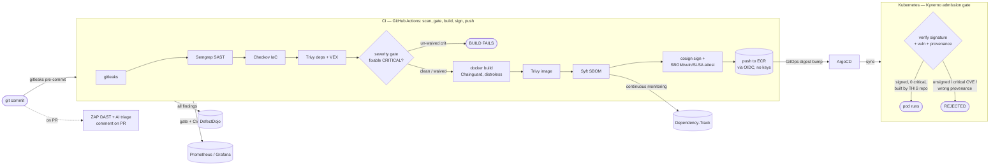

# Secure Software Supply Chain Pipeline

An end-to-end DevSecOps pipeline that takes an application from `git commit` all
the way to a running Kubernetes pod, and puts a **security control at every
stage**. The sample app is deliberately vulnerable — the point isn't that the app
is clean, it's that **nothing insecure reaches production without a control
catching it or blocking it**.

The design in one line: *scanners provide visibility, admission control provides
enforcement.* CI scans everything and reports it, but never blocks the
intentionally-vulnerable demo. The hard gate is at deploy time — the cluster
refuses to run an image unless the pipeline signed it **and** its signed
vulnerability record shows zero critical CVEs. CI happily builds, signs, and
pushes the vulnerable image; the cluster rejects it. **That rejection is the
demo.**

> Built around SBOMs, signing, attestations, and SLSA-style provenance — the
> supply-chain security stack (Sigstore/cosign, Syft, Kyverno) that's become the
> hottest area in the field.

---

## Contents

1. [What this demonstrates](#what-this-demonstrates)
2. [Architecture](#architecture)
3. [The pipeline, stage by stage](#the-pipeline-stage-by-stage)
4. [Key concepts](#key-concepts) — the parts to actually understand
5. [The supply-chain gate](#the-supply-chain-gate-the-punchline)
6. [Getting started](#getting-started) — from "just look" to "run it all"
7. [Secrets](#secrets) — what CI needs, and how each optional stage gates on it
8. [Adapt it to your own app](#adapt-it-to-your-own-app)
9. [Repository layout](#repository-layout)
10. [Engineering notes](#engineering-notes-real-problems-solved)
11. [Security & cost](#security--cost)

---

## What this demonstrates

A single project covering the full modern secure-SDLC job description:

- **Shift-left scanning** — secrets, SAST, dependency CVEs, and IaC misconfig, all in CI.
- **Supply-chain integrity** — SBOM generation, keyless signing, and signed attestations including **SLSA build provenance** that the cluster verifies against *this* repo and workflow.
- **Policy-as-code enforcement** — a Kubernetes admission controller that makes runtime decisions on cryptographic evidence (signature + vuln + provenance).
- **GitOps delivery** — the git repo is the source of truth; ArgoCD syncs it.
- **Keyless / keyless-everywhere** — OIDC federation means no long-lived cloud keys or signing keys exist to leak.
- **Vulnerability management** — every finding aggregated into DefectDojo, and the SBOM pushed to **Dependency-Track** for continuous monitoring (a CVE disclosed *after* deploy still surfaces against the shipped image).
- **A CI severity gate with governed exceptions** — the build hard-fails on un-waived fixable criticals; every exception is a dated, reasoned waiver, and stale waivers break the build.
- **Measured image hardening** — a multi-stage Chainguard build cut container CVEs from **14 CRITICAL / 91 HIGH → 3 / 14** (the remaining criticals are the demo's intentional npm deps, kept so the admission gate still has something to reject).
- **DAST on ephemeral per-PR environments** — an OWASP ZAP baseline runs against the live app and comments on the PR.
- **False-positive handling with OpenVEX** — triaged, not-exploitable CVEs are formally marked and filtered from the visibility scans (never from the admission scan).
- **Observability + adversarial proof** — a live Grafana security dashboard, plus a [red-team writeup](docs/red-team.md) that attacks every control and asserts each is blocked.
- **AI-assisted triage** — Claude prioritizes the scan output and comments on PRs.

## Architecture



## The pipeline, stage by stage

| # | Stage | Tool | What it catches | Where |
|---|-------|------|-----------------|-------|
| 1 | Pre-commit | **gitleaks** | secrets, before they're committed | [`.pre-commit-config.yaml`](.pre-commit-config.yaml), [`.gitleaks.toml`](.gitleaks.toml) |
| 2 | SAST | **Semgrep** | command injection, hardcoded secrets in source | [`semgrep/rules.yaml`](semgrep/rules.yaml) |
| 3 | Dependencies | **Trivy (fs) + VEX** | vulnerable npm packages, minus triaged false positives | [pipeline](.github/workflows/pipeline.yml), [`vex/`](vex/) |
| 4 | IaC | **Checkov** | misconfigured Terraform | [`terraform/`](terraform/), [`.checkov.yaml`](.checkov.yaml) |
| 5 | **Severity gate** | **Trivy + waivers** | **HARD-fails on un-waived fixable CRITICAL** | [`.trivyignore.yaml`](.trivyignore.yaml), [`scripts/check-waivers.sh`](scripts/check-waivers.sh) |
| 6 | Image | **Trivy (image)** | OS + library CVEs in the container | [pipeline](.github/workflows/pipeline.yml) |
| 7 | DAST *(PRs)* | **OWASP ZAP** | runtime issues against the live app in an ephemeral container | [pipeline](.github/workflows/pipeline.yml), [`.zap/`](.zap/) |
| 8 | SBOM | **Syft** | full inventory of what's inside (CycloneDX + SPDX) | [`scripts/generate-sbom.sh`](scripts/generate-sbom.sh) |
| 9 | Integrity | **cosign** | keyless signature + SBOM / vuln / **SLSA provenance** attestations | [`scripts/sign-and-attest.sh`](scripts/sign-and-attest.sh) |
| 10 | Registry | **ECR + OIDC** | signed image storage, no stored AWS keys | [`terraform/`](terraform/) |
| 11 | Aggregation | **DefectDojo** | one dashboard for every finding | [`scripts/defectdojo-upload.sh`](scripts/defectdojo-upload.sh) |
| 12 | Monitoring | **Dependency-Track** | continuous CVE re-check of the shipped SBOM | [`k8s/dependency-track/`](k8s/dependency-track/), [`scripts/dependency-track-upload.sh`](scripts/dependency-track-upload.sh) |
| 13 | Metrics | **Prometheus + Grafana** | findings-over-time, gate pass/fail, critical count | [`k8s/monitoring/`](k8s/monitoring/), [`scripts/push-metrics.sh`](scripts/push-metrics.sh) |
| 14 | AI triage *(PRs)* | **Claude** | prioritized "fix these first" comment on the PR | [`scripts/ai-triage.mjs`](scripts/ai-triage.mjs) |
| 15 | Delivery | **ArgoCD** | GitOps sync from the repo | [`argocd/application.yaml`](argocd/application.yaml) |
| 16 | **Admission gate** | **Kyverno** | **rejects unsigned, critically-vulnerable, or wrong-provenance images** | [`policies/kyverno/`](policies/kyverno/) |

The spine that runs these on every push/PR is [`.github/workflows/pipeline.yml`](.github/workflows/pipeline.yml). Every attack this stops is enumerated and asserted in [`docs/red-team.md`](docs/red-team.md).

## Key concepts

If you take one thing from this repo, take these — they're what make it more than "a bunch of scanners in CI."

- **SBOM (Software Bill of Materials)** — a machine-readable inventory of every package inside the image. Syft produces it in CycloneDX and SPDX. It answers "am I affected by CVE-X?" in seconds instead of a fire drill.
- **Keyless signing** — cosign signs the image using GitHub Actions' short-lived OIDC identity via Sigstore (Fulcio issues a momentary certificate, Rekor logs it publicly). **There is no private signing key** to store or leak; the signature proves "the pipeline in *this* repo produced this exact image."
- **Attestation** — a *signed statement about* an artifact. Here, the SBOM and the Trivy vulnerability report are each attached to the image as signed attestations. The cluster later makes admission decisions on that evidence — it doesn't re-scan, it trusts a signed record it can verify.
- **Admission control** — Kyverno sits in the Kubernetes API path and inspects every pod *before* it runs. Policies here fail **closed**: can't verify → deny.
- **OIDC federation** — CI pushes to AWS ECR with *zero* stored access keys. GitHub presents a short-lived token; an IAM trust policy scoped to only this repo's `main` branch accepts it. Same trust model as the signing.
- **Visibility vs. enforcement** — the deliberate split: scanners *report* (soft, non-blocking), admission *enforces* (hard, blocking). This is why the vulnerable demo builds successfully yet still can't run.
- **SLSA build provenance** — the image carries a keyless-signed [SLSA v1 provenance](policies/kyverno/verify-provenance.yaml) attestation describing *how it was built*. Kyverno doesn't just check "is it signed" — it asserts the provenance says the image was built **from this repository by a GitHub-hosted runner**. An attacker with signing access still can't admit an image whose provenance points elsewhere. (Honest scope: verifiable Build **L2** — cosign v2 keyless attestation; L3 would need the isolated `slsa-github-generator`, which Kyverno 1.18 can't verify.)
- **Continuous SBOM monitoring** — generating an SBOM is table stakes; the SBOM is pushed into **Dependency-Track**, which keeps it and re-checks it against fresh CVE feeds. A vulnerability disclosed *next month* surfaces against the already-deployed image. That's the shift from "scanning" to "vulnerability response."
- **VEX (Vulnerability Exploitability eXchange)** — [an OpenVEX document](vex/vulnerable-demo-app.openvex.json) formally records which CVEs are *not exploitable* here (e.g. the vulnerable code path is never reached) with a justification. Trivy consumes it to filter the **visibility** scans — deliberately **not** the admission scan, which stays strict.
- **Severity gate + governed exceptions** — CI hard-fails on any *fixable* CRITICAL. Real orgs can't block everything, so every exception is an explicit, dated waiver in [`.trivyignore.yaml`](.trivyignore.yaml); [`check-waivers.sh`](scripts/check-waivers.sh) fails the build once a waiver lapses, so "temporary" exceptions can't quietly become permanent. The demo's intentional criticals are waived (a CI-side risk acceptance) — which does **not** weaken the admission gate, so Kyverno still refuses them.
- **Image hardening, measured** — a multi-stage build with a **Chainguard** runtime (nonroot, no shell, no package manager) eliminates the OS CVE surface: **14→3 CRITICAL, 91→14 HIGH** ([`scripts/measure-cve-delta.sh`](scripts/measure-cve-delta.sh) reproduces the number). The intentionally-old npm deps stay, so the vuln gate still has real criticals to block.

## The supply-chain gate (the punchline)

The most interesting part is the loop between build-time attestation and deploy-time enforcement:

1. CI runs `trivy image --format cosign-vuln` and `cosign attest`s the result to the image digest — a signed, tamper-evident record of the image's vulnerabilities.
2. Syft's SBOM and a **SLSA v1 build-provenance** predicate are attested the same way.
3. All are signed **keyless** via the GitHub Actions OIDC identity.
4. At deploy, three policies fail **closed**: [`verify-image-signature`](policies/kyverno/verify-signature.yaml) rejects anything we didn't sign; [`block-critical-vulnerabilities`](policies/kyverno/verify-vuln-attestation.yaml) fetches the vuln attestation and denies on any critical; [`verify-build-provenance`](policies/kyverno/verify-provenance.yaml) asserts the provenance says the image was built from *this* repo by a GitHub-hosted runner.

Proven live on a k3d cluster:

```
resource Deployment/demo/vulnerable-demo-app was blocked due to the following policies

block-critical-vulnerabilities:
  check-vuln-attestation: 'image attestations verification failed,
    verifiedCount: 0, requiredCount: 1 ... predicate
    https://cosign.sigstore.dev/attestation/vuln/v1'
```

The image was validly built, signed, and pushed by CI — the cluster still refuses
it, because its own signed Trivy attestation reports **3 CRITICAL** CVEs (the
intentional npm deps that survive hardening; the OS layer dropped from 14 → 0). An
**unsigned** image is refused too, and so is any image whose SLSA provenance points
at a different repo. All three policies fail closed. Every finding across all
scanners lands in DefectDojo, and the SBOM feeds Dependency-Track for ongoing
re-checks — while a Grafana dashboard tracks findings-over-time and gate pass/fail.

## Getting started

### Prerequisites

Depends how far you want to go:

| Path | Needs |
|------|-------|
| Look at reports locally | `docker`, plus the CLIs `make scan` calls (gitleaks, semgrep, checkov, trivy); `node` for AI triage |
| Full CI pipeline | a GitHub fork + an AWS account (free tier), `terraform`, `aws` CLI |
| Cluster gate demo | `docker`, `k3d`, `kubectl`, `aws` CLI (configured) |
| DefectDojo dashboard | `docker` (compose) |
| Monitoring + Grafana | the k3d cluster above (`make monitoring`) |

### Path A — Just look (no cloud)

Run every scanner locally; reports land in `artifacts/`:

```bash
make hooks          # install the gitleaks pre-commit hook
make scan           # gitleaks + semgrep + checkov + trivy (VEX-filtered) → artifacts/*.json
make build sbom     # build the image and generate its SBOM
make cve-delta      # print the before/after hardening CVE count (14→3 CRIT, 91→14 HIGH)
make severity-gate  # HARD-fail on any un-waived fixable critical (waivers checked first)
make red-team       # run the pipeline's attacks and assert each is blocked
```

### Path B — Run the whole pipeline (your fork + AWS)

1. **Fork** this repo.
2. Replace `Advit105/secure-supply-chain-pipeline` with your `owner/repo` in all three Kyverno policies ([`policies/kyverno/`](policies/kyverno/) — signature, vuln, and provenance) and the Terraform variable [`terraform/variables.tf`](terraform/variables.tf) (`github_repository`).
3. Configure AWS locally (`aws configure`) and provision the registry + CI role:
   ```bash
   terraform -chdir=terraform init
   terraform -chdir=terraform apply   # creates ECR + the GitHub OIDC role, all free tier
   ```
4. Copy the printed `github_actions_role_arn` into your repo's **Settings → Secrets and variables → Actions** as `AWS_ROLE_ARN`.
5. `git push`. CI now scans, builds, signs+attests, pushes to ECR, and commits the signed digest back into [`k8s/deployment.yaml`](k8s/deployment.yaml).

> The OIDC `sub` claim on newer GitHub accounts is `repo:OWNER@id/REPO@id:ref:...` — the Terraform variable must match *that* exact form (decode a workflow token's `sub` to get your IDs). See [Engineering notes](#engineering-notes-real-problems-solved).

### Path C — Watch the admission gate reject a pod

One script stands up a local cluster (k3d), installs Kyverno + the two policies, and attempts the deploy. Registry stays real ECR; the cluster is local (free-tier friendly, no EC2):

```bash
scripts/demo-cluster.sh      # ends with the deploy being REJECTED
```

For full GitOps instead of `kubectl apply`, register the ArgoCD Application:
```bash
kubectl apply -f argocd/application.yaml   # a vulnerable image leaves it stuck "Degraded"
```

Tear down when done: `k3d cluster delete supply-chain`.

### Path D — The DefectDojo dashboard

Stand up DefectDojo and import the reports. Full steps (including a macOS gotcha) are in [`defectdojo/README.md`](defectdojo/README.md):

```bash
git clone https://github.com/DefectDojo/django-DefectDojo && cd django-DefectDojo
docker compose pull && docker compose up -d --no-build     # http://localhost:8080
# then, from this repo, with an API token:
DD_URL=http://localhost:8080 DD_API_KEY=<token> OUT_DIR=artifacts bash scripts/defectdojo-upload.sh
```

### Path E — Continuous monitoring + the Grafana dashboard

Deploy Dependency-Track and the Prometheus/Grafana stack into the same k3d cluster, push the SBOM, and watch the panels go live:

```bash
make monitoring                                    # applies k8s/dependency-track + k8s/monitoring
# Dependency-Track UI (needs two port-forwards — the SPA calls the API from your browser):
kubectl -n security-tools port-forward svc/dtrack-apiserver 8081:8080 &
kubectl -n security-tools port-forward svc/dtrack-frontend 8082:8080   # open http://localhost:8082
# push the SBOM (create an API key in the DT UI first):
DEPTRACK_URL=http://localhost:8081 DEPTRACK_API_KEY=<key> OUT_DIR=artifacts bash scripts/dependency-track-upload.sh
# Grafana:
kubectl -n security-tools port-forward svc/grafana 3000:3000          # open http://localhost:3000 → "DevSecOps Security Metrics"
```

## Secrets

Everything runs with **zero secrets** for local scanning and the cluster-gate demo. The cloud and aggregation stages are each gated behind one secret so they **skip cleanly (grey)** instead of failing until you wire them up (see the `preflight` job). Set these under **Settings → Secrets and variables → Actions**:

| Secret | Enables | Required? |
|--------|---------|-----------|
| `AWS_ROLE_ARN` | build → sign → push to ECR (OIDC, no static keys) | for the full pipeline |
| `DEFECTDOJO_URL` / `DEFECTDOJO_API_KEY` | findings aggregation in DefectDojo | optional |
| `DEPTRACK_URL` / `DEPTRACK_API_KEY` | continuous SBOM monitoring in Dependency-Track | optional |
| `PUSHGATEWAY_URL` | pushing gate + CVE metrics to Grafana | optional |
| `ANTHROPIC_API_KEY` | AI-assisted triage comment on PRs | optional |

No signing secret exists — cosign is fully keyless (Fulcio + Rekor via the workflow's OIDC identity), and AWS is reached via OIDC federation. There is nothing to rotate or leak in CI.

## Adapt it to your own app

The pipeline is the reusable part; the app is a swappable target. To point it at
your own app (or OWASP Juice Shop), change **one file**: replace
[`app/Dockerfile`](app/Dockerfile) with your build (e.g. `FROM bkimminich/juice-shop`),
and update the image name (`vulnerable-demo-app`) in the Terraform repo name,
Kyverno `imageReferences`, and k8s manifests. Everything else — scanning,
signing, attesting, the gate — is unchanged.

## Repository layout

```
app/                 deliberately vulnerable Node app; Dockerfile (Chainguard, hardened)
                     + Dockerfile.vulnerable (baseline for the CVE-delta measurement)
.github/workflows/   pipeline.yml — the CI spine (scan → gate → build → sign → push)
semgrep/             custom SAST rules
terraform/           ECR repository + GitHub OIDC role (Checkov-scanned)
scripts/             generate-sbom, sign-and-attest (+SLSA provenance), defectdojo-upload,
                     dependency-track-upload, check-waivers, measure-cve-delta,
                     push-metrics, red-team, ai-triage, demo-cluster
k8s/                 Namespace / Deployment / Service (ArgoCD's source)
k8s/dependency-track/  in-cluster Dependency-Track (continuous SBOM monitoring)
k8s/monitoring/      in-cluster Prometheus + Pushgateway + Grafana (provisioned dashboard)
argocd/              GitOps Application
policies/kyverno/    the admission gate: signature + vuln + provenance policies
vex/                 OpenVEX doc (triaged false positives)
.zap/                ZAP baseline rule tuning (DAST)
docs/red-team.md     the attack-each-control writeup, mapped to OWASP CI/CD Top 10
defectdojo/          how to stand up the aggregation dashboard
.gitleaks.toml       secret-scanning rules
.checkov.yaml        IaC scan config
.trivyignore.yaml    time-boxed security waivers (the severity gate's risk register)
Makefile             local entry point for every stage
```

## Engineering notes (real problems solved)

The gnarly, portfolio-worthy bits — each is a genuine supply-chain integration failure and its fix:

- **GitHub's ID-augmented OIDC claim** — newer accounts emit `sub = repo:OWNER@id/REPO@id:ref:...`, not the classic `repo:OWNER/REPO:...` every tutorial assumes. The IAM trust policy matched exactly and rejected everything until pinned to the real claim (which is *stronger* — those numeric IDs survive repo renames / name-squatting).
- **cosign v3 vs. Kyverno** — cosign v3 writes signatures in the OCI-referrers/bundle layout; Kyverno 1.18 only discovers the legacy `.sig`/`.att` tag layout, so admission failed with "no signatures found" on a validly-signed image. Pinned cosign to v2.6.3.
- **Immutable tags vs. attestations** — ECR strict tag immutability (a Checkov best-practice) rejects cosign appending its second attestation to the shared `.att` tag. Solved with `IMMUTABLE_WITH_EXCLUSION`: app tags immutable, only cosign's `sha256-*` tags mutable.
- **The visibility/enforcement split** — scanners are report-only so the intentionally-vulnerable demo still builds; the hard gate lives at admission. Without this the pipeline would block itself forever.
- **The severity gate caught its own base image** — the first hardening pass used `gcr.io/distroless/nodejs18`, but the new CI severity gate immediately failed on a *fixable* OpenSSL CRITICAL (CVE-2026-31789) that the debian-12 distroless images hadn't rebuilt against yet. Waiving a fresh OpenSSL RCE is a bad look, so the fix was the right one: switch to Chainguard's continuously-rebuilt `node` image (0 OS CVEs). The gate did exactly its job — it forced a base-image decision instead of letting a stale critical ship.
- **Keeping VEX out of the gate** — VEX filters the report-only scans, but the cosign vuln attestation that feeds Kyverno is produced *without* `--vex`. If a well-meaning edit added VEX there, a "not exploitable" ruling could silently disable admission enforcement — so [`red-team.sh`](scripts/red-team.sh) greps for exactly that and fails if it ever appears.

## Security & cost

- **No long-lived secrets** — both AWS access (OIDC) and image signing (keyless) use short-lived, federated identities. Nothing to rotate or leak in CI.
- **Free tier** — ECR + IAM cost nothing at this scale; the cluster runs locally (k3d), not on EC2. The one deliberate cost trade-off (no KMS CMK on ECR) is documented and shows up as a *live* Checkov finding — intentional demo data.
- **`.gitignore`** excludes Terraform state (which can contain sensitive values) and all scan artifacts.

> ⚠️ The app under [`app/`](app/) is **intentionally vulnerable** (command
> injection, hardcoded secret, outdated dependencies). It exists to be scanned
> and rejected. Do not deploy it anywhere real.
